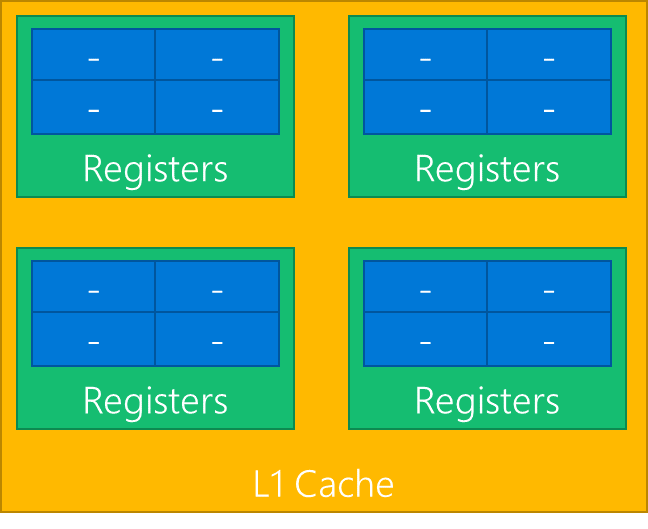
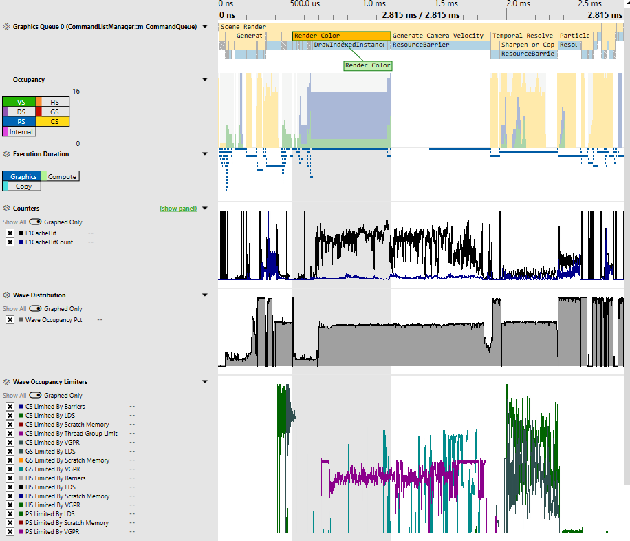
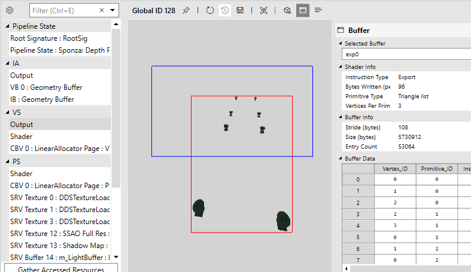

# Analyzing frames with GPU captures

GPU (or frame) captures record all of the Direct3D 12 API calls your application makes, typically in a single frame (see [Take a GPU capture](#take-a-gpu-capture)). PIX can replay those API calls to show you information about API call parameters, pipeline and resource states, resource contents, and more.

> [!TIP]
> It's not always possible for PIX to successfully take a GPU capture if a game is calling Direct3D 12 in invalid ways. PIX makes a best effort to be robust even in the case of incorrect usage patterns, but this is inevitably sometimes a case of garbage in, garbage out. If you are having difficulty taking GPU captures, try using the [D3D12 Debug Layer and GPU-based validation](~/direct3d12/using-d3d12-debug-layer-gpu-based-validation.md) to find and fix any bad API calls.

## Take a GPU capture

From the **Connection** view, either launch or attach to your desired process (ensuring the relevant **For GPU Capture** option is checked).

Configure your GPU capture options as necessary. To take the capture, either click the **Take GPU Capture** button in PIX or press Alt+Print Screen (or F11, configurable in PIX settings). You will see a thumbnail of the capture in the PIX UI. At this point you can terminate your application if desired. Click on the thumbnail to open the capture.

### Programmatic captures

You can programmatically take a capture using the WinPixEventRuntime. For details, see the blog post [Programmatic capture](https://devblogs.microsoft.com/pix/programmatic-capture/).

## View API calls with the events view

The **Events** view shows all the API calls that were recorded into a GPU capture. There is a separate list for each Direct3D 12 queue (graphics, compute, or copy) that was used by the game.

The event list can be filtered, optionally using regular expressions (click the button labeled **.\***). By default it shows only events that resulted in actual rendering work for the GPU hardware, as opposed to simply preparing state for use by later operations. To include non-GPU events, click the button labelled **!G**.

More information about each event, such as the full set of API call parameters, is available in the **Event Details** view. That view is included by default in the **Pipeline** tab, but can also be added to your current layout via the **Layout Design Mode** button in the upper right corner of the main PIX window.

## Frame profiling

With a GPU capture open, switch to the Overview tab. Here you'll see some basic details about the capture.

To start profiling, you'll need to collect timing data. To do that, click the **Collect Timing Data** button at the top right of the **Events** view, or click the **Click here to start analysis and collect timing data** text in the **Timeline** view. That replays the GPU work in the capture and collect basic timing data such as Execution Durations (annoted with [PixEvents](pix-instrumenting.md), if your application has them). Once finished, you can collect additional data to be graphed in Timeline lanes, like occupancy information and other GPU-specific counters.

> [!TIP]
> For best results, don't interact with your computer while PIX is collecting timing data; and close any other applications that might be using the GPU.

You can also see counters broken down by API call in the **Events** view. To enable/disable counters, click the **Event List Counters** button (top right of the **Events** view).

### Timing data

There are two sources of GPU timing information:

1. Start-of-pipe timestamps report when the GPU starts processing each piece of work. Note that this data is available only when running Windows 10, build 14393 (or greater) with a suitable graphics driver (see the blog post [Requirements](https://devblogs.microsoft.com/pix/requirements/)). Timing data takes longer to collect if start-of-pipe timestamps are not available.
2. End-of-pipe (EOP) timestamps report when the GPU has finished processing each piece of work.

Because GPUs are massively parallel and deeply pipelined, it's common for more than one piece of work to be executing at the same time, and for adjacent operations to overlap. PIX measures time in two different ways that can offer insight into the parallel execution model of the hardware:

1. Execution Duration is measured from the start-of-pipe to the end-of-pipe timestamp of each separate piece of work. When measured in this way, GPU work items that run in parallel with prior items might appear longer than if they were run in isolation, due to contention on the GPU.
2. EOP Duration is measured from the previous item's end-of-pipe (EOP) timestamp to this item's EOP timestamp. Work items that run in parallel with prior items will therefore appear shorter than if they ran in isolation, and some items may even be reported as zero duration if they completed entirely in parallel with the previous item.

The **Timeline** view displays one or more lanes showing the timing of each GPU operation. There's a separate lane containing EOP Duration data for each queue (graphics, compute, or copy) used by the game, plus a single lane showing Execution Duration data (where available) combined across all the queues.

> [!TIP]
> PIX on Windows doesn't currently overlap GPU work on different queues while analyzing timing in GPU captures. Consider taking a [Timing capture](pix-timing-captures.md) if you want to see overlapping async compute timing data. In GPU Captures, if a game uses async compute to execute rendering and compute work simultaneously, then PIX will instead measure first one and then the other. This may result in shorter reported durations for each part of the work compared to how it would execute inside the original game (due to reduced contention on the GPU) but a longer total time (due to reduced parallelization).

### GPU counters and occupancy

PIX exposes hardware-specific performance counters provided by IHVs via a GPU plugin. These counters can be enabled and collected in either the **Event List Counters** view (button to enable at top right of **Events** view) or the **Timeline Counters** view (button to enable at top right of **Timeline** view).

On some GPUs, PIX can also gather occupancy information. GPUs are usually constructed as a hierarchy of repeated blocks, where each level might share a resource. For example, an imaginary GPU might be structured like this

GPUs execute shaders by breaking up the shader work into waves (those are also called warps, or wave fronts). In the above diagram, each blue block is capable of executing one wave. Each green block could execute up to four waves.

As all the blues share a single set of registers, if a workload needs all the registers then only one wave at a time can execute in the green block. In that case the occupancy of the green block would be 1, out of a total possible occupancy of 4.

At any time, all the green blocks might be executing a different number of waves. Of the four green blocks above, one might be executing 3 waves, another 2 waves, and the remaining 1 wave. PIX boils all that data down to a single value&mdash;the maximum occupancy, which would be 3 in this example.

That's presented in PIX in the **Occupancy** lane, which shows the maximum occupancy, separated by shader stage. That's an indication of how much work the GPU is able to do in parallel&mdash;higher bars show better GPU utilization.

## Debugging rendering issues

With a GPU capture open, switch to the **Pipeline** tab. That tab contains an **Events** view, several state and resource inspector views, and a **Pipeline** view.

Selecting an event in the **Events** view populates various views, notably the Pipeline view, which can be used to inspect root signatures, and pipeline state, and bound resources. The **Pipeline** view is also the entry point into **Shader Debugging**.

> [!TIP]
> To perform most features, you'll need to start analysis. Analysis is how PIX collects timing data, state information, and resources. There are many ways to start analysis, but the global way is via the **Start Analysis Play** button at the top-right of the application. Make sure the desired GPU is selected.

### View Direct3D 12 objects, parameters, and state

After selecting an event in the **Events** view, the **State and Pipeline** views (found in the **Pipeline** tab) show details of the Direct3D state at the time of that event. There you can view which resources are bound to the pipeline, shader code, inputs, outputs, and the currently bound rendertarget(s).

### Shader debugging

After selecting an appropriate event, and running analysis, you can debug your shaders. In the **Pipeline** view, there are several ways to initiate shader debugging:
1. Select the **Shader** entry under the desired shader stage, and click the green play button. Before starting the debug session, ensure that you configure the appropriate shader parameters (for example, instance and vertex IDs for vertex shaders, or pixel coordinates for pixel shaders).
2. Right-clicking in a resource viewer (for example, VS Output or an SRV/UAV/RTV) and selecting the appropriate **Debug** option.
3. Clicking the **Debug Pixel** button in the **Pixel Details** view when viewing an appropriate resource (for example, SRV/UAV/RTV).

> [!TIP]
> If you're not able to see the shader source when debugging, you're likely missing debug information. Ensure you're generating the shader PDBs for your application, and that you have [configured PIX to load those PDBs](pix-configuring.md#debug-symbols).

#### Shader edit & continue

HLSL shader code can be edited directly inside PIX, allowing you to immediately see the effect of your changes on rendering results or performance. That can be useful for prototyping and optimizing shaders, because it can greatly reduce the turnaround time when trying out different ideas.

After selecting a shader, you can edit its code however you like, then click **Edit** > **Apply**. Other views (such as OM RTV 0) will update to show the effect of your change. You might find it useful to dock more than one instance of the **Pipeline** view next to each other in order to view rendertarget results at the same time as editing shader code.

If you lose track of exactly what you'ave changed, then right-click on the shader code, and choose **Diff with Original**.

> [!TIP]
> PIX on Windows doesn't yet support saving modified shaders back into the capture file.

### Debug visualizers

Rendertarget visualizers are available in the **Pipeline** view when inspecting the contents of a rendertarget. The default image visualizer just shows the image as normal, and can be changed by selecting a different visualization in the **Visualization** view.

### Pixel history

For any pixel-like resource (for example, RTVs, UAVs, or depth buffers), you can view all operations that affected a particular pixel by using **Pixel History**. That can be accessed by right-clicking on the desired pixel, and selecting **Show Pixel History**, or by clicking the **Pixel History** button in the **Pixel Detail**s view.

## Caveats and miscellaneous notes

- It is not always possible for PIX to successfully take a GPU capture if a game is calling Direct3D 12 in invalid ways. PIX makes a best effort to be robust even in the case of incorrect usage patterns, but this is inevitably sometimes a case of garbage in, garbage out. If you are having difficulty taking GPU captures, then try using the [D3D12 Debug Layer and GPU-based validation](../../direct3d12/using-d3d12-debug-layer-gpu-based-validation.md) to find and fix any bad API calls.
- Windows GPU captures are not, in general, portable across different GPU hardware and driver versions. In most cases, a capture taken on one machine will play back correctly on other similar GPUs from the same hardware family, and captures of some games may even work across GPUs from entirely different manufacturers, but it's also possible that something as trivial as a driver upgrade could break compatibility with older captures. PIX can guarantee playback will succeed only when the GPU and driver are exactly the same, so PIX will warn before starting analysis if there is not a perfect match. Proceed past that warning at your own risk.
- PIX has limited support for multiple GPUs. It will always play back GPU captures on a single adapter, regardless of how many adapters the application used. PIX allows you to select the playback adapter from a drop-down affordance in the PIX toolbar. PIX will attempt to auto-select the playback adapter if the application used only one adapter.
- For non-deterministic ExecuteIndirect workloads, you might want to enable the **Use replay-time ExecuteIndirect argument buffers** setting.
