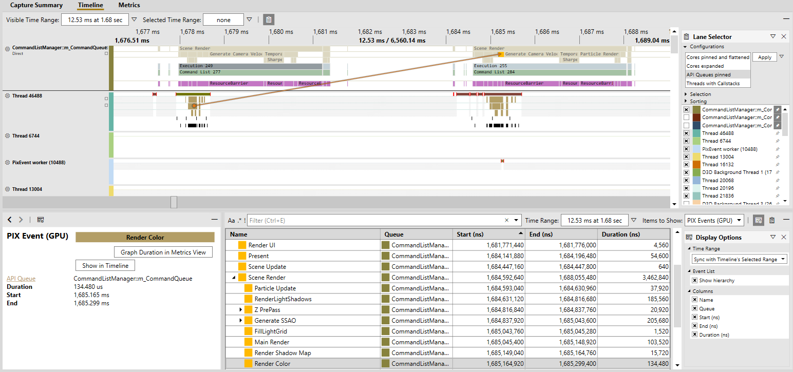
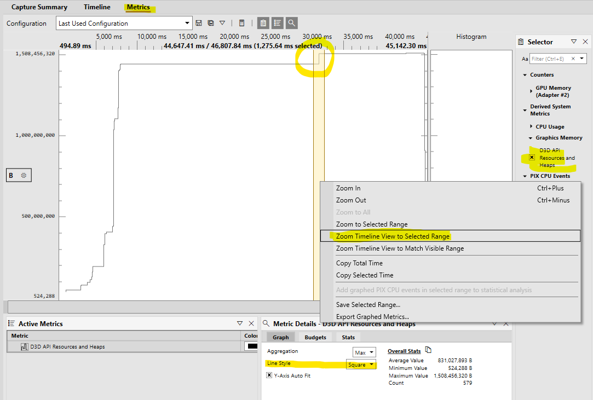

# CPU and GPU Profiling with Timing Captures
Timing Captures combine both CPU and GPU profiling data into a single capture for in-depth analysis of your application. This data is gathered while the game is running, and with minimal overhead, so you can see things like how work is distributed across CPU cores, the latency between graphics work being submitted by the CPU and executed by the GPU, when file IO accesses and memory allocations occur and so on. This also includes [application-defined events, markers, and counters via PixEvents](pix-instrumenting.md).

## Taking a Timing Capture
From the Connection view, either launch or attach to your desired process (ensuring the relevant "For GPU Capture" option is unchecked).

Configure your Timing Capture options as necessary and, when ready, click the Start Timing Capture button to begin recording. Click Stop Timing Capture (or terminate the application) to end the recording. After a brief processing period the capture will open.

### Timing Capture Options
| Name | Description |
| ---- | ----------- |
| Capture Mode | Sequential: Record entirety of events between starting and stopping the capture.  Circular: Record events into a fixed size buffer, only saving the last n seconds of data. See this [Circular Timing Captures blog post](https://devblogs.microsoft.com/pix/circular-timing-captures/) for more details. |
| CPU Samples | Perform sample profiling to see where CPU is spending time. Sample rate is configurable. |
| Callstacks on Context Switches | Collect callstacks when a thread switches contexts. |
| File accesses | Track file accesses. |
| GPU timings | Collect detailed timing information about when GPU work starts and stops. |
| GPU resources | Collected **detailed** information about D3D objects like heaps and resources. Also track GPU residency, demoted allocations, and allocation migrations. |
| VirtualAlloc/VirtualFree events | Tracks allocations made via the VirtualAlloc and VirtualFree functions. |
| HeapAlloc/HeapFree events | Tracks allocations made via the HeapAlloc and HeapFree functions. |
| Custom allocator events | Tracks allocations made by [custom memory allocators instrumented with PixEvents](https://devblogs.microsoft.com/pix/memory-profiling-support-for-allocations-made-from-a-titles-custom-allocator/).|
| Page Fault events | Collect data on page faults that occur when the capture is running. The page faults are shown in the timeline and in the element details view. |
| Callstacks for non-title processes | Capture callstacks for processes other than the title process (the launched or attached to process). |
| Kernel image information | Collect information need to show callstacks for kernel binaries. |
| Generate .etl file instead of .wpix file | The generated .etl file can later be converted to a .wpix file in the File \| Convert menu. This option is useful when reporting bug repros to the WinPIX team or if you have other tooling for processing ETW data. |

### Programmatic Captures
You can programmatically take a capture using the WinPixEventRuntime. Details can be found at https://devblogs.microsoft.com/pix/programmatic-capture/.

## CPU Profiling
Enabling the "CPU Samples" option when taking a capture can help you pinpoint slow functions in your application's hot path, as well as find issues related to thread waits and context switches. You'll also be able to track different kinds of allocations (with the appropriate capture option enabled).

There are several blog posts that cover these features in detail:
- [Overview of Timing Captures](https://devblogs.microsoft.com/pix/timing-captures-new/)
- [Analyzing CPU Samples in Timing Captures blog post](https://devblogs.microsoft.com/pix/analyzing-cpu-samples-in-timing-captures/).
- [Analyzing Stalls and Context Switches in Timing Captures](https://devblogs.microsoft.com/pix/analyzing-stalls-and-context-switches-in-timing-captures/)
- [Analyzing Memory Usage and Performance in Timing Captures](https://devblogs.microsoft.com/pix/analyzing-memory-usage-and-performance-in-timing-captures/)
  - You can also instrument your own custom allocators. See [this Custom Allocator blog post](https://devblogs.microsoft.com/pix/memory-profiling-support-for-allocations-made-from-a-titles-custom-allocator/) for more details.

## GPU Profiling
Intermittent frame drops? Excessive VRAM usage? Unexpected paging operations between system memory and VRAM? The GPU Profiling features in WinPIX can help you get to the bottom of these common and difficult to analyze situations.

### GPU Timings
Enable the "GPU timings" option when taking a capture to collect timing data for GPU work. In the Timeline view, you can find lanes for each GPU queue (tip: in the Lane Selector you can quickly pin these lanes with the "API Queues pinned" configuration). These lanes contain several sublanes:
- PIX Events (GPU): Hierarchicial, application-defined regions of GPU Work. See [PixEvents](pix-instrumenting.md).
- GPU Executions: Executions correspond to work submissions at the API level, eg via ExecuteCommandLists.
- GPU Work: Any work that occurs on the GPU, eg Draws, Dispatches, Copies.
- PIX Markers (GPU): Application-defined markers. See [PixEvents](pix-instrumenting.md).

When you select an event in the lane, you will see arrows showing where on the CPU that event originated. There are also various visualization options in the lane options menu (the gear icon next to the lane name). Most notably, the Flatten Events and Flatten GPU Work options are enabled by default to preserve space, but you may want to see the full PIX Event hierarchy or GPU Work paralellization when diving into a specific frame.

This data is also available in tabular form via Range Details View by selecting the relevant category in the Items to Show dropdown.

#### Presentation and Display Info
Vsyncs are displayed as markers in a separate Monitor lane, and can be found in Range Details View within the Other category.

### GPU Memory and Direct3D Objects
Enable the "GPU resources" option when taking a capture to collect information about Direct3D objects. To graph overall memory usage, you can find several counters in Metrics view. You can configure various budget lines to get a quick idea of whether you're meeting your memory usage goals. When you find an area of interest, you may want to investigate further by selecting the time range, clicking Zoom Timeline View to Select Range in the right-click context menu, and setting the Selected Time Range dropdown to Select visible range.

> [!TIP]
> Setting the Line Style to "Square" makes it easier to see where the allocations are made.

In Range Details View, you can view various information about D3D API Objects likes heaps, resources, and pipeline state objects. This information is grouped by when it was allocated and freed to make it easier to pinpoint any suspicious objects.

#### Residency
For residency related issues, check out the Residence Operations, Demoted Allocations, and Allocation Migrations categories of Range Details View. These markers and events are also shown in the Residence Operations lane.

Residence Operations include the MakeResident and Evict operations (initiated via the Direct3D 12 API) as well as any PageIn and PageOut operations (see the [Direct3D 12 Programming Guide article about Residency](~/direct3d12/residency.md) for more details). Demoted Allocations occur when the graphics kernel (DXGK) cannot allocate a resource in your GPU's VRAM (due to either memory pressure or fragmentation). If this happens, DXGK will also attempt to perform Allocation Migrations for those demoted allocations. Note that these migrations are expensive operations, as it requires suspending the GPU.

## Win32 File IO
See [Analyzing Win32 File IO Performance in Timing Captures](https://devblogs.microsoft.com/pix/analyzing-win32-file-io-performance-in-timing-captures/).

## Other Analysis Features
- Statistical comparisions help determine which portions of a PIX event hierarchy have statistically different durations for the set of points being compared. Find details in this [Statistical Comparison announcement post](https://devblogs.microsoft.com/pix/timing-capture-statistical-comparison-features/).
- Setting performance budgets can help you quickly identify problematic areas of the capture. See the [Using Performance Budgets blog post](https://devblogs.microsoft.com/pix/using-performance-budgets-in-the-timing-capture-metrics-view/) for more details.
- [Critical Path Analysis](https://devblogs.microsoft.com/pix/critical-path-analysis-in-timing-captures/).
